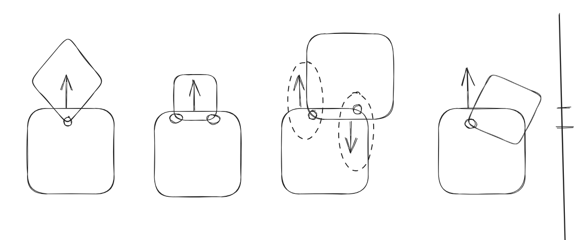

# PythonPhysicsEngine
## Architecture
### Collsion Representation
For now a collision is represented by a `Collision` object which has exactly one penetrating point, a collision normal, a collision depth and the two collisind objects. 
In cases where there are 2 points with exactly the same depth, two `Collision` objects are created.
The first object in the `Collision` object is penetrated by the second object. 
Accoordingly the second object is the object that contains the penetrating point. 
The normal points outwards from the penetrated object (first object).

In a future version the representation might be changed so that both points are stored in one object depending on whether the collision solver can benefit from such a representation.
Alternativly the `Collision` object could be extended to reference another `Collision` object in case of a second point.

## Assumptions/Limitations
- no deformable objects
- no fluids
- constant density of objects (over time and space) --> center of mass is constant in the bodies relative coordinate system
- only convex polygons and circles (but manual combination of them into a composed object is possible)

