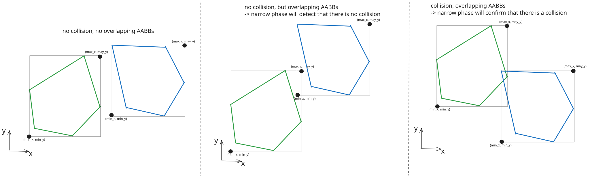
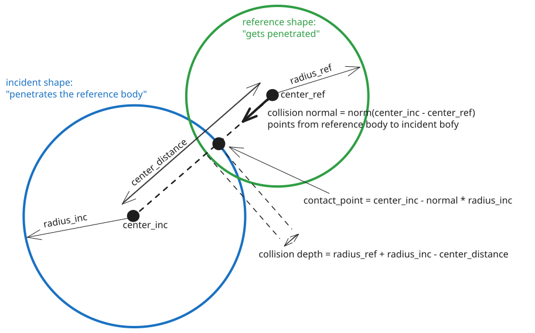
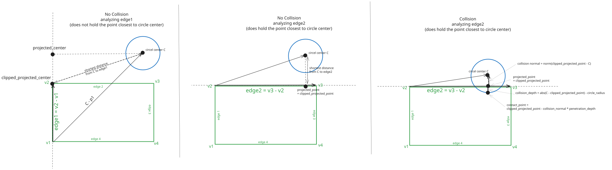

# Collision Detection
Collision detection is a crucial part of any physics engine.
It is responsible for determining whether two shapes are colliding and generating the necessary contact data for collision resolution.
Only if this contact data is available, the solver can resolve the collision correctly and compute the appropropriate response so that objects behave realistically (i.e. don't pass through each other and change their velocities accordingly).
For another detailed overview of 2D collision detection and resolution, check out [this extremly well-written blog post](https://timallanwheeler.com/blog/2024/08/01/2d-collision-detection-and-resolution/) by Tim Wheeler.

## Broad Phase vs Narrow Phase Collision Detection
Collision detection is typically divided into two phases: broad phase and narrow phase.
The broad phase is responsible for quickly filtering out pairs of objects that are definitely not colliding.
This is important because checking every possible pair of objects in the simulation for collisions would be computationally expensive, especially in simulations with many objects (we need to check O(n^2) pairs).
The narrow phase is then responsible for performing detailed collision detection on the remaining candidate pairs identified by the broad phase.
We will first discuss the broad phase implementations available in the engine, followed by the narrow phase collision detection using the Separating Axis Theorem (SAT).

## Broad Phase Implementations
### AABB Broad Phase
This is a basic broad phase implementation that uses Axis-Aligned Bounding Boxes (AABBs) to quickly filter out non-colliding pairs.
While its theoretical complexity is still quadratic with the number of objects since it checks all pairs, the amount of compute per checked pair is much lower than a full narrow phase check on all of the body pairs.



First step is to compute the AABB for each body in the simulation.
An AABB is defined by its minimum and maximum extents along the x and y axes.
The exact computation of the AABB depends on the shape of the body but is generally straightforward.
Have a look at the `get_aabb` method in the shape classes for the specific implementations.
In the implementation of this engine the AABBs are returned as `((min_x,min_y), (max_x, max_y))` tuples.

After computing the AABBs, we can check for overlaps between them.
Whether two AABBs overlap can be determined super simpy:
```python
def aabbs_overlap(aabb1, aabb2):
    (min1, max1) = aabb1
    (min2, max2) = aabb2
    
    if max1[0] < min2[0] or max2[0] < min1[0]:
        return False  # No overlap in x-axis
    if max1[1] < min2[1] or max2[1] < min1[1]:
        return False  # No overlap in y-axis
    return True  # Overlap detected
```
One needs to repeat this check for all pairs of AABBs in the simulation.
Only the pairs of bodies whose AABBs overlap are passed to the narrow phase for detailed collision detection.
The full implementation of the AABB broad phase can be found in [`ppe/engine/collision_broad.py`](../ppe/engine/collision_broad.py) in the `AABBBroadPhase` class.
Note that in the implementation, we allow for pairs of static bodies (i.e. bodies with infinite mass that do not move) to be excluded from the broad phase checks entirely.

### Spatial Partitioning Broad Phase
Not yet implemented.

## Narrow Phase Collision Detection
After the broad phase has filtered out pairs of bodies that are definitely not colliding, the narrow phase performs detailed collision detection on the remaining candidate pairs.
This ensures that we only spend computational resources on pairs that are likely to be colliding.
Besides detecting whether a collision occurred, the narrow phase is also responsible for generating contact data that describes the collision in detail (collision normal, penetration depth, contact points).
These information are crucial for the solver to compute the correct collision response (i.e. how the bodies should react upon colliding).

### Handling Different Shape Types with a Dispatch System
Depending on the types of shapes involved in the collision, different algorithms may be more suitable for detecting collisions.
For now this engine supports Circles and convex Polygon shapes.
In future support for other shapes (e.g. Capsules, Concave Polygons) and compound shapes (i.e. shapes made up of multiple simpler shapes) may be added.

To handle the different combinations of shape types, the engine uses a dispatch system.
When a pair of shapes is passed to the narrow phase, the dispatch system determines the types of the shapes and selects the appropriate collision detection algorithm for that specific combination.
This is implemented in the `DispatchNarrowPhase` class found in [`ppe/engine/collision_narrow.py`](../ppe/engine/collision_narrow.py).
The `DispatchNarrowPhase` class maintains a mapping of shape type pairs to their corresponding collision handler classes.
This mapping can be modified during construction, achieving a high modularity and allows for easy experimentation with different collision detection algorithms.

Side Note: To make sure that a circle-polygon pair is handled the same way as a polygon-circle pair, the dispatch system always orders the shapes by an numeric type ID before looking up the handler.

### Circle vs Circle
To start with the simplest case, we first look at circle-vs-circle collision detection.
Before diving into the algorithm, lets introduce some terminology that will be useful when discussing collision detection in general:
- **Collision Normal**: A unit vector that points from one shape to the other. It indicates the direction in which the shapes should be separated.
- **Contact Point**: The point at which the two shapes are touching or penetrating each other. Represents the location where the collision response force will be applied.
- **Penetration Depth**: A scalar value that indicates how much the two shapes are overlapping. It is used to determine how far the shapes need to be separated to resolve the collision.
- **Reference Shape**: The shape that provides the collision normal. The collision normal points outwards from the reference shape. You can think of the reference shape as the shape that is being "penetrated into".
- **Incident Shape**: The shape that is penetrating into the reference shape. You can think of the incident shape as the shape that is doing the "penetrating". In the circle-vs-circle case, we can arbitrarily choose one of the circles as the reference shape and the other as the incident shape.

The algorithm is for the circle-vs-circle collision detection is straightforward:
1. Compute the distance between the centers of the two circles.
2. Compare this distance to the sum of the radii of the two circles. If the distance is less than the sum of the radii, a collision has occurred.

To generate the contact data, we need to compute the collision normal, penetration depth, and contact point.
In the circle-vs-circle case, we can compute these values as follows:
- Collision Normal: This is the normalized vector pointing from the center of the reference circle to the center of the incident circle. We can choose the reference circle arbitrarily.
- Penetration Depth: This is calculated as the sum of the radii minus the distance between the centers.
- Contact Point: This is the point where the extension of the collision normal intersects the surface of the incident circle. It can be computed by moving from the center of the incident circle along the negative collision normal by the radius of the incident circle.



The full implementation of the circle-vs-circle collision handler can be found in [`ppe/engine/collision_handlers.py`](../ppe/engine/collision_handlers.py) in the `CircleVsCircleHandler` class.

### Circle vs Polygon
The main idea of the circle-vs-polygon collision detection algorithm we use here is to find the closest point on the polygon to the center of the circle.
If the distance from the center of the circle to this closest point is less than the radius of the circle, a collision has occurred.

Finding the closest point on the polygon involves checking each edge of the polygon and determining the closest point on that edge to the circle's center.
To compute the the closest point on an edge, to a point, we can use the following approach:
1. Compute the vector from the start vertex of the edge to the end vertex of the edge.
2. Compute the vector from the start vertex of the edge to the circle center.
3. Project the vector from step 2 onto the vector from step 1 to find the scalar projection. If this scalar is less than 0, the closest point is the start vertex. If it is greater than 1, the closest point is the end vertex of the edge. Otherwise, the closest point lies on the edge and can be computed by scaling the edge vector by the scalar projection and adding it to the start vertex. As formula: `closest_point = edge_start + clip(scalar_projection) * edge_vector` with `scalar_projection = dot(circle_center - edge_start, edge_vector) / dot(edge_vector, edge_vector)`.

We repeat this process for all edges of the polygon to find the overall closest point.
Once we have the closest point, we can compute the collision normal, penetration depth, and contact point as follows:
- Collision Normal: This is the normalized vector pointing from the closest point on the polygon to the center of the circle. `collision_normal = normalize(circle_center - closest_point)`.
- Penetration Depth: This is calculated as the radius of the circle minus the distance from the center of the circle to the closest point on the polygon. `penetration_depth = circle_radius - distance(circle_center, closest_point)`.
- Contact Point: The contact point is the point on the circle's surface that is on the line defined by the collision normal. It can be computed by moving from the center of the circle along the negative collision normal by the radius of the circle. `contact_point = circle_center - collision_normal * circle_radius`.



Note that the first two cases in the image will never be checked in this implementation, since the broad phase AABB check will filter them out already.

The full implementation of the circle-vs-polygon collision handler can be found in [`ppe/engine/collision_handlers.py`](../ppe/engine/collision_handlers.py) in the `CircleVsPolygonHandler` class.

A pseudocode implementation of the algorithm is as follows:
```
min_distance = infinity
closest_projected_point = None

for each edge in polygon:
    edge_vector = edge.end_vertex - edge.start_vertex
    to_circle_vector = circle.center - edge.start_vertex
    
    scalar_projection = dot(to_circle_vector, edge_vector) / dot(edge_vector, edge_vector)
    clamped_scalar = clamp(scalar_projection, 0, 1)
    
    projected_point = edge.start_vertex + clamped_scalar * edge_vector
    distance_to_circle = distance(circle.center, projected_point)
    
    if distance_to_circle < min_distance:
        min_distance = distance_to_circle
        closest_projected_point = projected_point

if min_distance < circle.radius:
    collision_normal = normalize(circle.center - closest_projected_point)
    penetration_depth = circle.radius - min_distance
    contact_point = circle.center - collision_normal * circle.radius
    return CollisionData(collision_normal, penetration_depth, contact_point)
else:
    return None  # No collision
```

### Separating Axis Theorem (SAT)
The Separating Axis Theorem (SAT) is a fundamental algorithm to detect the collision between two convex shapes.
The concrete implementation in this engine (`SatPolygonHandler`) can be found in `ppe.engine.collision_handlers.polygon_vs_polygon`.
I will approach the explanation by starting with the most basic version of the algorithm and then gradually add more details and optimizations.

#### Basic Algorithm
The core idea is that if there exists an axis along which the projections of the two shapes do not overlap, then the shapes are not colliding.
Conversely, if no such axis exists, the shapes are colliding.
Instead of checking all possible axes (which would be computationally impossible ;)), it's sufficient to check all the axes that are perpendicular to the edges of the shapes.
This results in the following pseudocode for the basic version of the SAT algorithm:

```
for each edge in both shapes:
    axis = perpendicular_vector(edge)
    
    projection_values_1 = project_shape_onto_axis(shape1.vertices, axis)
    projection_values_2 = project_shape_onto_axis(shape2.vertices, axis)

    if not projections_overlap(projection_values_1, projection_values_2):
        return False  # Found a separating axis, no collision

return True  # No separating axis found, shapes are colliding
```

#### Finding Collision Normal and Penetration Depth
However, this simple version has a key limitation: For correct collision response, we need more information than just whether a collision occurred. 
We also need to know the collision normal (the axis along which the shapes are colliding) and the penetration depth (how much the shapes overlap along that axis).
If theres a collision, the projections usually overlap on multiple axes.
We define the collision normal as the axis with the smallest overlap, and the penetration depth as the amount of that overlap.
To find the collision normal and penetration depth, we can keep track of the axis with the smallest overlap:

```
func project_shape_onto_axis(shape, axis):
    min_proj = infinity
    max_proj = -infinity
    for vertex in shape.vertices:
        projection = dot(vertex, axis)
        min_proj = min(min_proj, projection)
        max_proj = max(max_proj, projection)
    return (min_proj, max_proj)

min_overlap = infinity
collision_normal = None

for each edge in both shapes:
    axis = perpendicular_vector(edge)
    
    projection1 = project_shape_onto_axis(shape1, axis)
    projection2 = project_shape_onto_axis(shape2, axis)
    
    if not projections_overlap(projection1, projection2):
        return False  # Found a separating axis, no collision
    
    overlap = calculate_overlap(projection1, projection2)
    if overlap < min_overlap:
        min_overlap = overlap
        collision_normal = axis
```

#### Finding the Contact Points
In order to compute the rotation induced by the collision, we also need to find the contact points.
The contact points are the points on the shapes that are in contact during the collision.
Since in the simulation, the collision is always a tiny overlap of the shapes, the contact points are the intersection points of the edges of the two shapes.
Finding these intersection points is easier said than done.
Before continuing, lets introduce some terminology:
- Reference Edge: The edge that is being penetrated into. Or more formally, the edge along whose normal the collision normal is aligned (the edge that produced the minimum overlap).
- Incident Edge: The edge that is penetrating into the reference edge. Formally, we define the incident edge as the edge whose normal is most opposite to the reference edge normal. Note that in an concave polygon, this edge always corresponds to one of the edges adjacent to the vertex that is deepest in the reference edge.
One option would be to check the for intersections of all edges of the incident shape with the reference edge.

#### Computational Optimizations
Checking for overlapping projections can be simplified computationally:
Instead of projecting all the vertices from both shapes onto the axis, its more efficient if we calculate just the distance of all points from the other shape to the currently analyzed edge.
The distance of a point to an edge can be calculated using the dot product between the edge normal and the vector from a point on the edge to the point in question.
If all the distances have the same sign, then the shapes are not colliding along that axis.
Furthermore, if we can assume that all normals are pointing outwards of the shape, we can reuse the computed distances to determine the collision depth as well.
Note that to allow the assumption that all normals point outwards, we need to ensure that the vertices of each polygon are defined in a consistent winding order (clockwise or counter-clockwise).

Assuming our polygons have N and M edges respectively, the new version of the SAT algorithm has a time complexity of O(N + M) instead of O(N * M) in the naive version.
<!-- While in theory, this is a significant improvement, in practice, the difference is often negligible since the number of edges in typical polygons used in physics simulations is usually quite small. -->
```
min_overlap = infinity
collision_normal = None
for each edge in shape_1:
    axis = perpendicular_vector(edge) # assume outward pointing normals
    
    distances_to_edge = [dot(axis, vertex - edge.start_vertex) for vertex in shape2.vertices]

    if all(distance > 0 for distance in distances_to_edge):
        return False  # Found a separating axis, no collision

    overlap = abs(min(distances_to_edge))

for each edge in shape_2:
    axis = perpendicular_vector(edge) # assume outward pointing normals
    
    distances_to_edge = [dot(axis, vertex - edge.start_vertex) for vertex in shape1.vertices]

    if all(distance > 0 for distance in distances_to_edge):
        return False  # Found a separating axis, no collision

    overlap = abs(min(distances_to_edge))
```

This version will not work correctly 