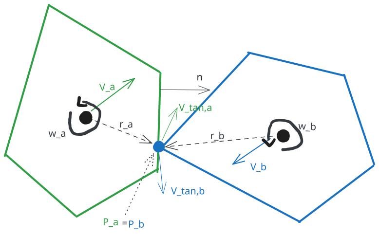

# Physical Constraint Solvers
The purpose of a physical constraint solver is to predict the new physical state of bodies in a simulation so that the numerous constraints implied by correct physical behavior are satisfied.
Such constraints can be for example:
- Non-penetration constraints that prevent bodies from overlapping after a collision.
- Joint constraints that enforce a specific relative motion between two bodies (e.g., a hinge joint).
- Friction constraints that limit the relative motion between contacting bodies.

Depending on the type of solver used, different properties of the simulated bodies are adjusted to satisfy these constraints.
For example, some solvers adjust the positions of the bodies directly to resolve penetrations, while others modify the velocities or apply impulses to achieve the desired effect over time.
The following sections will first give a high-level overview of different types of solvers and then a more detailed exploration of the solvers implemented in this physics engine.

## Different Types of Solvers: Direct Solvers, Iterative Solvers and Penalty-based Solvers
While all solvers share the same goal—satisfying constraints—the mathematical approach they take to reach that goal varies significantly. 
Broadly speaking, solvers can be categorized into three families: Penalty-based, Direct, and Iterative.

**Penalty-based Solvers** are the earliest and conceptually simplest approach to physics simulation. 
They treat rigid bodies as if they were connected by stiff springs.
When a constraint is violated (e.g., a ball penetrates the floor), the solver calculates a "penalty force" proportional to the depth of the penetration ($F = -kx$).
This force pushes the objects apart over subsequent frames (due to the integration of forces into velocities and positions).
Penalty-based solvers are straight-forwar to implement, handle energy conservation naturally and computationally cheap for simple scenes.
However, to simulate truly rigid ("hard") objects they require a higgh "spring" stiffness which introduces instability, requiring small time steps to prevent the simulation from exploding (blowing up). As a result, collisions often feel "squishy" or "spongy.

**Direct Solvers** solvers aim for mathematical perfection. 
They view the simulation as a single, massive system of linear equations that describes the motion of every object in the world simultaneously.
The solver constructs a large matrix representing all constraints and body interactions (often formulated as a so called Linear Complementarity Problem or LCP). 
It then uses matrix algebra methods to calculate the exact forces required to satisfy all constraints exactly.
Direct solvers are extremely stable, can handle complex stacking of objects perfectly without jitter and produces truly "rigid" behavior
Howver, the computational cost grows exponentially with the number of objects ($O(n^3)$). 
While feasible for non-realtime simulations or simulations with small numbers of objects, it is generally too slow for real-time game simulations and just overkill for many scenarios.

**Iterative Solvers** are the industry standard for game physics (e.g. used by Box2D, Bullet, Chipmunk). 
It strikes a balance between the speed of penalty methods and the stability of direct methods.
Instead of solving the entire world at once, the solver looks at the (violated) constraints one by one. 
It fixes constraint A, then moves to constraint B, then C. 
By the time it fixes C, constraint A might be slightly broken again. 
Therefore, the solver repeats this loop multiple times (iterations) per frame. 
With enough iterations, the system "converges" to a solution where all constraints are mostly satisfied.
Iterative solvers are fast ($O(n)$), easy to implement and allow for setting a trade-off between performance and accuracy by adjusting the number of iterations.
However, the solution generated by iterative solver is still an approximation. 
If the iteration count is too low, the simulation will suffer from unrealistic behavior like jittering or sinking objects.

## Iterative Impulse-based Solver
One of the solvers implement in this package is an _Iterative Sequential Impulse_ Solver. 
This is a most common approach in game physics (used by Box2D, Chipmunk, and Bullet) because it offers a good trade-off between performance and stability.
The core idea is the following: we apply impulses (which change velocity instantaneously) so that the objects will move so that they satisfy all the imposed constraints.
Remeber that an impulse $J$ applied to a body changes its velocity according to the formula:
$$\Delta v = \frac{J}{m}$$
where $m$ is the mass of the body
E.g. when two bodies collide, we want to find a specific impulse magnitude $j$ such that, when applied to both bodies along the collision normal, their relative velocity becomes zero (or reflects based on restitution).
Likewise we can find impulses so that objects move under friction constraints or joint constraints.
The solver iterates over all constraints multiple times, applying impulses each time to gradually correct the velocities of the bodies until all constraints are sufficiently satisfied (or we reach a defined maximum number of iterations).

The pseudo-code for the iterative impulse-based solver will look something like this in case of collision constraints without other effects like friction or rotation:

```python
for iteration in range(max_iterations):
    for constraint in constraints:
        j = compute_impulse_magnitude(constraint)
        constraint.bodyA.velocity -= (j / constraint.bodyA.mass) * constraint.normal
        constraint.bodyB.velocity += (j / constraint.bodyB.mass) * constraint.normal
```

A basic iterative impulse-based solver is implement as `SimpleIterativeImpulseSolver` in the [`ppe.engine.solvers`](../ppe/engine/solvers) module.
A more verbose version that also accounts for rotational effects and friction is implemented as `IterativeImpulseSolver` in 

### Deriving the Impulse Magnitude for a Collision Constraint
So the big question is: how do we derive the impulse magnitude $j$ for a given constraint?
Lets start with the simplest case: a collision between two bodies without rotational effects or friction.
As mentioned above, we want to find a specific impulse magnitude $j$ such that, when applied to both bodies along the collision normal, their relative velocity changes appropriately.
First, let's define some variables and basic equations:
- $v_a$, $v_b$: the velocities of body A and body B before the impulse is applied.
- $v_a'$, $v_b'$: the velocities of body A and body B after the impulse is applied.
- $n$: the collision normal (a unit vector pointing from body A to body B).
- $j$: the magnitude of the impulse to be applied along the normal.

The relative velocity along the normal before the impulse is given by:

$$v_{rel} = (v_b - v_a) \cdot n \tag{1}$$

After applying the impulse, the new velocities will be:

$$v_a' = v_a - \frac{j}{m_a} n \tag{2.1}$$

$$v_b' = v_b + \frac{j}{m_b} n \tag{2.2}$$

Note that we divide the impulse by the mass of each body to get the change in velocity.
The heavier a body is, the higher is its resistance to changes in velocity.

<!-- the new relative velocity along the normal after the impulse can therefore be expressed as: -->
Setting equations (2.1) and (2.2) into (1) we get the following expression for the new relative velocity:

$$v_{rel}' = (v_b' - v_a') \cdot n = \left((v_b + \frac{j}{m_b} n) - (v_a - \frac{j}{m_a} n)\right) \cdot n \tag{3.1}$$

Simplifying this expression by using $n \cdot n = 1$ and rearranging terms gives:

$$v_{rel}' = \underbrace{(v_B - v_A) \cdot n}_{=v_{rel}} + {j \left(\frac{1}{m_A} + \frac{1}{m_B}\right)\underbrace{(n \cdot n)}_{=1}} = v_{rel} + j \left(\frac{1}{m_A} + \frac{1}{m_B}\right) \tag{3.2}$$

Due to Newton's law of restitution, we want the new relative velocity to be:

$$v_{rel}' = -e \cdot v_{rel} \tag{4}$$

where $e$ is the coefficient of restitution (a measure of how "bouncy" the collision is, with 0 being perfectly inelastic and 1 being perfectly elastic).

Setting the two expressions for $v_{rel}'$ equal to each other gives:

$$-e \cdot v_{rel} = v_{rel} + j \left(\frac{1}{m_A} + \frac{1}{m_B}\right) \tag{5}$$

Solving for $j$ yields:

$$j = \frac{-(1 + e) \cdot v_{rel}}{\left(\frac{1}{m_A} + \frac{1}{m_B}\right)} \tag{6}$$

Now that we know the impulse magnitude $j$, we can use it to update the velocities of both bodies accordingly:

$$v_a' = v_a - \frac{j}{m_a} n$$

$$v_b' = v_b + \frac{j}{m_b} n$$

#### Accounting for Rotation
If two objects collide off-center, they will also start to rotate or change their speed or direction of rotation.
In other words, not only their linear velocities $v_{lin}$ but also their angular velocities $\omega$ will change as a result of the collision.
To account for these rotational effects, we need to consider the point of contact of the collision and the resulting torques that an impulse resulting from the collision applied at that point will generate.
To do so, we no longer look at the relative linear velocity of the bodies but rather look at the relative velocity at the contact point.
The velocity of a point on a rigid body is given by the sum of its linear velocity and the tangential velocity due to its rotation and can be computed as:

$$v_{p_A} = v_{lin,A} + v_{tan,A} = v_{lin,A} + \omega_A \times r_A \tag{7.1}$$

Accordingly for body B: 

$$v_{p_B} = v_{lin,B} + v_{tan,B} = v_{lin,B} + \omega_B \times r_B \tag{7.2}$$

where $r_A$ and $r_B$ are the vectors from the centers of mass of bodies A and B to the contact point, and $\omega_A$ and $\omega_B$ are their angular velocities.
Note that the cross product $\times$ in 2D is a simple multiplication of the scalar angular velocity $\omega$ with the perpendicular vector of $r$.

The following image illustrates the situation:


Lets solve the problem in the same way as before, but now accouting for rotation.
First we derive a expression for the velocity at the contact point after applying the (not yet known) impulse $j$:

$$v_{p_A}' = v_{lin_A}' + v_{tan_A}' = v_{lin_A}' + \omega_A' \times r_A \tag{8}$$

For the linear term, we can reuse the exact same formula as before (2.1):

$$v_{lin_A}' = v_{lin_A} - \frac{j}{m_A} n$$

For the angular term, we need to derive how the angular velocity changes when applying an impulse at a point offset from the center of mass.
A impulse $j$ applied at a point generates a torque $\tau$ given by:

$$\tau_A = r_A \times (j \cdot n) \tag{9}$$

Analog to how the mass $m$ relates linear impulse to change in linear velocity, the moment of inertia $I$ relates torque to change in angular velocity.
We can therefore express the change in angular velocity $\Delta \omega$ as:

$$\Delta \omega_A = \frac{\text{torque induced by impulse}}{\text{moment of inertia}} = \frac{\tau_A}{I_A} = \frac{r_A \times (j \cdot n)}{I_A} \tag{10}$$

The moment of intertia for a polygon can be computed directly from its geometry but we wont derive that here. Checkout [the wikipedia article on moment of inertia](https://en.wikipedia.org/wiki/Moment_of_inertia) for more information.

Now inserting expression (10) into (8) and rearraning terms gives:

$$v_{p_A}' = \left(v_{lin_A} - \frac{j}{m_A} n\right) + \left(\omega_A + \frac{r_A \times (j \cdot n)}{I_A}\right) \times r_A = \underbrace{v_{lin_A} + \omega_A \times r_A}_{v_{p_A}} + \underbrace{(-j) \left(\frac{n}{m_A} + \frac{(r_A \times n) \times r_A}{I_A}\right)}_{\Delta v_{p_A}} \tag{11.1}$$

Analogously for body B we get:

$$v_{p_B}' = \left(v_{lin_B} + \frac{j}{m_B} n\right) + \left(\omega_B - \frac{r_B \times (j \cdot n)}{I_B}\right) \times r_B = \underbrace{v_{lin_B} + \omega_B \times r_B}_{v_{p_B}} + \underbrace{j \left(\frac{n}{m_B} + \frac{(r_B \times n) \times r_B}{I_B}\right)}_{\Delta v_{p_B}} \tag{11.2}$$

Now we can use the same approach as in the linear case to derive the impulse magnitude $j$ by usign the law of restitution again:

$$v_{rel_P}' = (v_{p_B}' - v_{p_A}') \cdot n = -e \cdot v_{rel_P}$$

We can now set equations (11.1) and (11.2) into (12) to get a quite lengthy expression for the new relative velocity which we can simplify step by step. Note that in the last step we use triple scalar product identity: $(a \times b) \cdot c = (b \times c) \cdot a$.

$$
\begin{align}
v_{rel_P}' &= \left(v_{p_B} + j \left(\frac{n}{m_B} + \frac{(r_B \times n) \times r_B}{I_B}\right) - v_{p_A} - (-j) \left(\frac{n}{m_A} + \frac{(r_A \times n) \times r_A}{I_A}\right)\right) \cdot n\\
&= \underbrace{(v_{p_B} - v_{p_A}) \cdot n}_{v_{rel_P}} + j \left(\frac{1}{m_A} + \frac{1}{m_B} + \frac{((r_A \times n) \times r_A) \cdot n}{I_A} + \frac{((r_B \times n) \times r_B) \cdot n}{I_B}\right) \\
&= v_{rel_P} + j \left(\frac{1}{m_A} + \frac{1}{m_B} + \frac{(r_A \times n)^2}{I_A} + \frac{(r_B \times n)^2}{I_B}\right)
\end{align}
$$

Setting this expression equal to the desired relative velocity from (12) and solving for $j$ gives:

$$v_{rel_P}' = -e \cdot v_{rel_P} = v_{rel_P} + j \left(\frac{1}{m_A} + \frac{1}{m_B} + \frac{(r_A \times n)^2}{I_A} + \frac{(r_B \times n)^2}{I_B}\right) \tag{14}$$
$$j = \frac{-(1 + e) \cdot v_{rel_P}}{\left(\frac{1}{m_A} + \frac{1}{m_B} + \frac{(r_A \times n)^2}{I_A} + \frac{(r_B \times n)^2}{I_B}\right)} \tag{15}$$

Now we can compute our updated linear and angular velocities for both bodies using the derived impulse magnitude $j$:

$$v_{lin_A}' = v_{lin_A} - \frac{j}{m_A} n \text{ and } v_{lin_B}' = v_{lin_B} + \frac{j}{m_B} n$$

$$\omega_A' = \omega_A + \frac{r_A \times (j \cdot n)}{I_A} \text{ and } \omega_B' = \omega_B - \frac{r_B \times (j \cdot n)}{I_B}$$

Even though the expressions used to derive the impulse magnitude $j$ are more complex when accounting for rotation, the overall steps are the same as in the simpler linear case:
1. Express the new velocities (linear and angular) by applying an unknown impulse $j$.
2. Compute the new relative velocity at the contact point.
3. Set the new relative velocity equal to the desired value based on the restitution.
4. Solve for the impulse magnitude $j$.

### Positional Correction with Baumgarte Stabilization
- better than "teleporting" workaround

### Why do we need multiple iterations?
- solving stacks...


### Limitations of the Iterative Impulse-based Solver

## Iterative Position-based Solver
